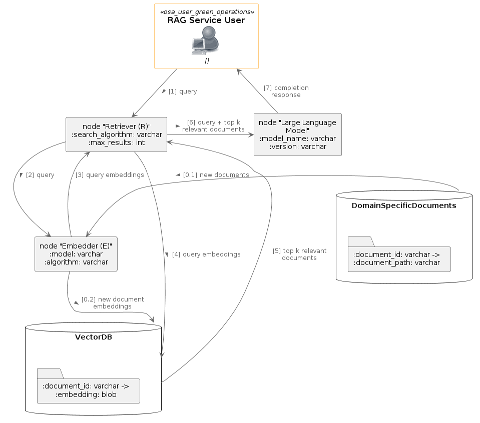

# RAG service

## Architecture Components

- **Embedder**: Handles converting documents and queries to vector embeddings.
- **Retriever**: Manages the retrieval of relevant documents based on the query's embeddings.
- **VectorDB**: Stores the embeddings and facilitates the search to find the most relevant documents.
- **LLM (Large Language Model)**: Takes the original query and the retrieved documents to generate a response.
- **Service Interface (FastAPI)**: The FastAPI application which would serve as the entry point for the service interacting with all other components.

